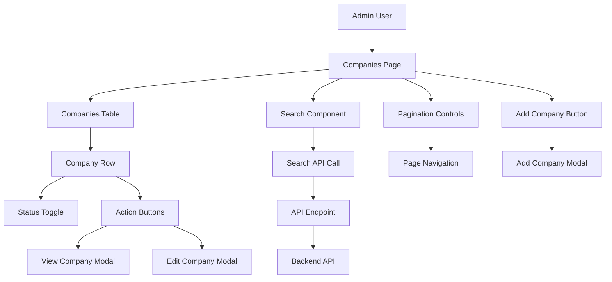

# Technical Design Document: Companies Listing

## 1. Overview

### 1.1 Purpose
The Companies Listing feature provides administrators with a comprehensive view of all companies in the system, enabling efficient management through search, sorting, pagination, and quick access to company actions (view, edit, add).

### 1.2 Scope
This implementation covers the frontend companies listing page with search functionality, sortable data table, pagination, and action buttons. The feature integrates with the backend API at `/api/admin/company/search` and provides a foundation for company management operations.

### 1.3 Success Metrics
- Page load time under 2 seconds
- Mobile responsiveness across all breakpoints
- Smooth pagination handling for 69+ companies
- Intuitive search and sorting functionality
- Accessible UI meeting WCAG 2.1 AA standards

## 2. Requirements

### 2.1 Functional Requirements

* **As an** admin user, **I want** to view a paginated list of companies, **so that** I can efficiently browse through all companies in the system
* **As an** admin user, **I want** to search companies by company ID or company name, **so that** I can quickly find specific companies
* **As an** admin user, **I want** to sort companies by different columns, **so that** I can organize data in meaningful ways
* **As an** admin user, **I want** to see company status at a glance, **so that** I can identify active/inactive companies quickly
* **As an** admin user, **I want** to access company actions (view, edit, add), **so that** I can manage company data efficiently

### 2.2 Non-Functional Requirements

* **Performance:** Initial page load under 2 seconds, search results under 500ms
* **SEO:** Not applicable (admin interface)
* **Accessibility:** WCAG 2.1 AA compliance, keyboard navigation, screen reader support
* **Security:** Admin role verification, input sanitization
* **Mobile:** Responsive design with touch-friendly interactions
* **Browser Support:** Modern browsers (Chrome 90+, Firefox 88+, Safari 14+)

## 3. Technical Design

### 3.1 Architecture Overview



### 3.2 Component Architecture

* **Server Components:**
  * Location: `app/companies/components/`
  * `CompaniesPage` - Main page wrapper with metadata
  * `CompaniesHeader` - Page title and add button
  * `CompaniesTable` - Data table container

* **Client Components:**
  * Location: `components/companies/`
  * `CompaniesSearch` - Search input with debounced API calls
  * `CompaniesDataTable` - Interactive data table with sorting
  * `CompanyRow` - Individual company row with actions
  * `StatusToggle` - Active/Inactive toggle switch
  * `ActionButtons` - View/Edit action buttons
  * `PaginationControls` - Page navigation and rows per page

* **Shared Components:** Reusable UI components from shadcn/ui
  * `Button` - Primary and secondary buttons
  * `Input` - Search input field
  * `Table` - Data table components
  * `Toggle` - Status toggle switches
  * `Dialog` - Modal dialogs for actions

* **Component Tree Structure:**
```
CompaniesPage (Server Component)
├── CompaniesHeader (Server Component)
│   ├── PageTitle
│   └── AddCompanyButton
├── CompaniesSearch (Client Component)
├── CompaniesDataTable (Client Component)
│   ├── TableHeader (sortable columns)
│   ├── CompanyRow (multiple instances)
│   │   ├── StatusToggle
│   │   └── ActionButtons
│   └── PaginationControls
└── LoadingStates
```

### 3.3 Data Model & State Management

* **TypeScript Interfaces:**
```typescript
interface Company {
  _id: string;
  companyName: string;
  companyEmail: string;
  companyId: string;
  isActive: boolean;
  storeCount: number;
  cfpCompanyCommission: number;
  providerId: string;
  serviceIds: string[];
  createdAt: string;
  companyEmails: string[];
  netspendGPRCardBrands: string[];
  netspendDDACardBrands: string[];
  ipRestrictionEnabled: boolean;
  xmintOverrideEnabled: boolean;
  productChoiceEnabled: boolean;
  productChoices: ProductChoice[];
}

interface ProductChoice {
  name: string;
  id: string;
  companyFee: number;
  commission: number;
  consumerFee: number;
  isEnabled: boolean;
}

interface CompaniesResponse {
  status: boolean;
  statusCode: string;
  statusText: string;
  data: Company[];
  error: string | null;
}

interface SearchParams {
  search?: string;
  page?: number;
  limit?: number;
  sortBy?: 'companyId' | 'companyName' | 'storeCount';
  sortOrder?: 'asc' | 'desc';
}
```

* **State Management Strategy:**
  * Local state with useState for UI state (search term, current page)
  * React Query for server state management and caching
  * Form state with controlled inputs for search
  * Optimistic updates for status toggles

* **Data Persistence:**
  * React Query cache with 5-minute stale time
  * Local storage for pagination preferences
  * No persistent search state across refreshes

### 3.4 API Design

* **API Integration:**
```typescript
// app/api/admin/company/search/route.ts
POST /api/admin/company/search
Request: {
  search?: string;
  page?: number;
  limit?: number;
  sortBy?: string;
  sortOrder?: 'asc' | 'desc';
}

Response: CompaniesResponse
```

* **React Query Configuration:**
```typescript
// hooks/use-companies.ts
const useCompanies = (params: SearchParams) => {
  return useQuery({
    queryKey: ['companies', params],
    queryFn: () => fetchCompanies(params),
    staleTime: 5 * 60 * 1000, // 5 minutes
    cacheTime: 10 * 60 * 1000, // 10 minutes
  });
};
```

### 3.5 Routing & Navigation

* **File-based Routing Structure:**
```
app/
├── companies/
│   ├── page.tsx              # Main companies page
│   ├── loading.tsx           # Loading UI
│   ├── error.tsx             # Error boundary
│   └── layout.tsx            # Companies layout
```

* **Navigation Patterns:**
  * Direct navigation to companies page
  * Modal-based actions (view, edit, add)
  * Pagination with URL state updates
  * Search with debounced API calls

### 3.6 UI/UX Design

* **Design System:**
  * shadcn/ui components with custom variants
  * TailwindCSS utility classes for consistent spacing
  * Color scheme: Green for active status, grey for inactive
  * Typography: Inter font family for readability

* **Responsive Design:**
  * Mobile-first approach with breakpoints: sm (640px), md (768px), lg (1024px), xl (1280px)
  * Table stacks vertically on mobile with card-like layout
  * Touch-friendly buttons and toggles
  * Optimized spacing for mobile interactions

* **User Interactions:**
  * Debounced search (300ms delay)
  * Immediate visual feedback for status toggles
  * Smooth pagination transitions
  * Loading skeletons during API calls

* **Accessibility:**
  * ARIA labels for all interactive elements
  * Keyboard navigation support (Tab, Enter, Space)
  * Screen reader announcements for status changes
  * High contrast ratios for status indicators

### 3.7 Data Fetching Strategy

* **Server-Side Rendering (SSR):**
  * Initial page load with loading state
  * No server-side data fetching (client-side only)

* **Client-Side Fetching:**
  * React Query for data fetching and caching
  * Optimistic updates for status changes
  * Background refetching for stale data
  * Error retry logic with exponential backoff

### 3.8 Performance Optimization

* **Bundle Optimization:**
  * Dynamic imports for heavy components
  * Code splitting by route
  * Tree shaking for unused components

* **Data Optimization:**
  * Pagination to limit data transfer
  * Efficient search with debouncing
  * React Query caching for repeated requests

* **Core Web Vitals:**
  * LCP: Optimize table rendering
  * FID: Debounced search input
  * CLS: Stable table layout

### 3.9 Security Considerations

* **Authentication & Authorization:**
  * Admin role verification required
  * Protected route implementation
  * API endpoint security

* **Input Validation:**
  * Search input sanitization
  * XSS prevention in data display
  * Rate limiting for search requests

### 3.10 Error Handling

* **Error Boundaries:**
  * Component-level error boundaries
  * Graceful fallbacks for failed API calls
  * User-friendly error messages

* **API Error Handling:**
  * HTTP status code handling
  * Retry mechanisms for network failures
  * Offline state handling

## 4. Implementation Plan

### 4.1 Development Phases

**Phase 1: Foundation**
- [ ] Set up companies page structure
- [ ] Implement TypeScript interfaces
- [ ] Create API integration layer

**Phase 2: Core Functionality**
- [ ] Implement companies table component
- [ ] Add search functionality with API integration
- [ ] Implement pagination controls

**Phase 3: UI/UX Polish**
- [ ] Add responsive design
- [ ] Implement loading states and skeletons
- [ ] Add accessibility features

**Phase 4: Performance & Testing**
- [ ] Implement React Query caching
- [ ] Add error handling and retry logic
- [ ] Performance optimization and testing

### 4.2 Dependencies

* **New packages to install:**
```json
{
  "@tanstack/react-query": "^4.29.0",
  "react-hook-form": "^7.45.0",
  "clsx": "^2.0.0",
  "tailwind-merge": "^1.14.0"
}
```

* **shadcn/ui components to add:**
```bash
npx shadcn-ui@latest add button
npx shadcn-ui@latest add input
npx shadcn-ui@latest add table
npx shadcn-ui@latest add toggle
npx shadcn-ui@latest add dialog
```

## 5. Testing Strategy

### 5.1 Unit Testing
* Component testing with React Testing Library
* Hook testing for custom hooks
* Utility function testing with Jest

### 5.2 Integration Testing
* API integration testing
* Search functionality testing
* Pagination flow testing

### 5.3 Visual Testing
* Responsive design testing
* Cross-browser compatibility
* Accessibility testing with axe-core

## 6. Monitoring & Analytics

### 6.1 Performance Monitoring
* Core Web Vitals tracking
* API response time monitoring
* Bundle size monitoring

### 6.2 User Analytics
* Search usage patterns
* Pagination behavior tracking
* Error rate monitoring

## 7. Documentation Requirements

* Component documentation with examples
* API integration guide
* Accessibility compliance documentation
* Performance optimization guide

## 8. Open Questions

* Should we implement column resizing for the table?
* Do we need export functionality for company data?
* Should search history be maintained for better UX?

## 9. Alternatives Considered

* **Client-side vs Server-side search:** Chose server-side for better performance with large datasets
* **Pagination vs Virtual scrolling:** Chose pagination for better accessibility and mobile experience
* **Local state vs Global state:** Chose local state with React Query for optimal performance

## 10. Migration Strategy

* No migration required - new feature implementation
* Feature flag strategy for gradual rollout
* A/B testing for search and pagination UX

---

This Technical Design Document provides a comprehensive roadmap for implementing the Companies Listing feature with modern React patterns, Next.js App Router, and optimal performance considerations.
