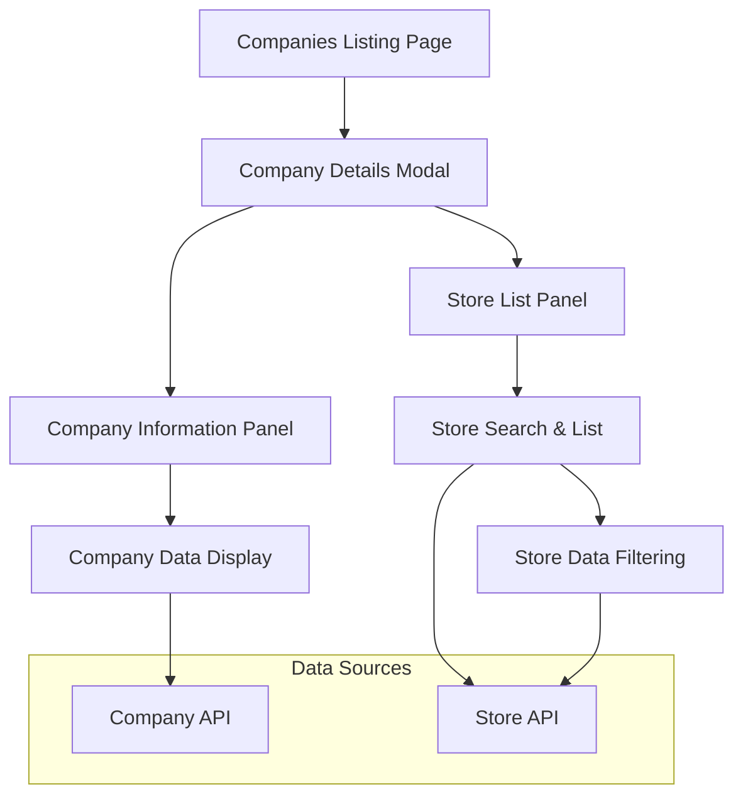

# Technical Design Document: Company Details Modal

## 1. Overview

### 1.1 Purpose
The Company Details Modal provides users with a comprehensive read-only view of company information, including company details, provider services, financial configurations, and associated store listings. This feature enables users to quickly access and review all relevant company data without navigating away from the companies listing page.

### 1.2 Scope
**Included:**
- Modal interface with two-panel layout (Company Information + Store List)
- Read-only display of all company data fields
- Real-time store search functionality
- Responsive design for mobile and desktop
- Modal overlay with proper z-index management

**Excluded:**
- Editing capabilities (read-only only)
- Data modification or deletion
- Export functionality
- Print functionality
- Real-time data synchronization

### 1.3 Success Metrics
- **User Experience:** Modal opens/closes within 200ms
- **Performance:** Store search responds within 100ms
- **Accessibility:** WCAG 2.1 AA compliance
- **Mobile Responsiveness:** Proper functionality across all device sizes
- **User Engagement:** Increased time spent viewing company details

## 2. Requirements

### 2.1 Functional Requirements

* **As a** logged-in user, **I want** to open a "Company details" modal from the companies listing page, **so that** I can view comprehensive company information without leaving the current page.

* **As a** user, **I want** to view all company information including contact details and provider services, **so that** I can understand the complete company profile.

* **As a** user, **I want** to see financial details like commission rates and product fees, **so that** I can review pricing and financial configurations.

* **As a** user, **I want** to browse the list of stores associated with the company, **so that** I can understand the company's operational scope.

* **As a** user, **I want** to search through the company's store list for specific locations, **so that** I can quickly find relevant store information.

### 2.2 Non-Functional Requirements

* **Performance:** Modal opens within 200ms, store search responds within 100ms, smooth animations (60fps)
* **SEO:** Not applicable (modal content not indexed)
* **Accessibility:** WCAG 2.1 AA compliance, keyboard navigation support, screen reader optimization
* **Security:** Input validation for search queries, XSS prevention
* **Mobile:** Responsive design with touch-friendly interactions, mobile-first approach
* **Browser Support:** Modern browsers (Chrome 90+, Firefox 88+, Safari 14+, Edge 90+)

## 3. Technical Design

### 3.1 Architecture Overview



### 3.2 Component Architecture

* **Server Components:**
  * Location: `app/companies/components/`
  * Company data fetching and caching
  * Store data pre-fetching for performance

* **Client Components:**
  * Location: `components/companies/`
  * Modal state management
  * Store search functionality
  * Responsive layout handling

* **Shared Components:**
  * shadcn/ui components: Dialog, Input, Button, Card, Badge
  * Custom components: CompanyInfoCard, StoreList, SearchInput

* **Component Tree Structure:**
```
CompanyDetailsModal (Client Component)
├── ModalHeader (Client Component)
│   ├── ModalTitle
│   └── CloseButton
├── ModalContent (Client Component)
│   ├── CompanyInfoPanel (Client Component)
│   │   ├── CompanyIdentification
│   │   ├── ContactProviderDetails
│   │   ├── ProductServiceConfig
│   │   ├── CardBrandConfig
│   │   └── InventoryProductLists
│   └── StoreListPanel (Client Component)
│       ├── StoreListHeader
│       ├── StoreSearchInput
│       ├── StoreListItems
│       └── ShowMoreButton
└── ModalFooter (Client Component)
    └── CloseButton
```

### 3.3 Data Model & State Management

* **TypeScript Interfaces:**
```typescript
interface CompanyDetails {
  id: string;
  companyId: string;
  companyName: string;
  companyEmails: string[];
  provider: string;
  providerServices: string[];
  customReceiptMessage: string;
  checkFreePayCommission: string;
  failedReversalEmails: string[];
  netspendGprCardBrands: string[];
  netspendDdaCardBrands: string[];
  inventoryReplenishmentEmails: string[];
  fiservProducts: {
    payoutToDebitCard: ProductFeeBreakdown;
    payoutToBankAccount: ProductFeeBreakdown;
  };
}

interface ProductFeeBreakdown {
  companyFee: string;
  commission: string;
  consumerFee: string;
}

interface Store {
  id: string;
  name: string;
  location?: string;
}

interface StoreListState {
  stores: Store[];
  filteredStores: Store[];
  searchQuery: string;
  isLoading: boolean;
  hasMore: boolean;
  currentPage: number;
}
```

* **State Management Strategy:**
  * Local state with useState for modal open/close
  * Local state with useReducer for store list management
  * Server state with native fetch for company data
  * Form state with controlled inputs for search

* **Data Persistence:**
  * Company data fetched on modal open
  * Store data cached in component state
  * Search results managed locally

### 3.4 API Design

* **New API Routes:**
```typescript
// app/api/companies/[id]/route.ts
GET    /api/companies/[id]        // Get company details by ID

// app/api/companies/[id]/stores/route.ts
GET    /api/companies/[id]/stores  // Get stores for company
Query params: page, limit, search
```

* **Request/Response Formats:**
```typescript
// GET /api/companies/[id]
Response: {
  success: boolean;
  data: CompanyDetails;
  error?: string;
}

// GET /api/companies/[id]/stores?page=1&limit=20&search=query
Response: {
  success: boolean;
  data: {
    stores: Store[];
    total: number;
    hasMore: boolean;
    currentPage: number;
  };
  error?: string;
}
```

* **Server Actions:** Not applicable for read-only functionality

### 3.5 Routing & Navigation

* **File-based Routing Structure:**
```
app/
├── companies/
│   ├── page.tsx              # Companies listing page
│   ├── loading.tsx           # Loading UI
│   ├── error.tsx             # Error boundary
│   └── components/
│       └── company-details-modal.tsx
```

* **Navigation Patterns:**
  * Modal opens from companies listing page
  * No additional routing required
  * Breadcrumb context maintained

### 3.6 UI/UX Design

* **Design System:**
  * shadcn/ui components: Dialog, Input, Button, Card, Badge, Separator
  * Custom component variants for company-specific displays
  * TailwindCSS utility classes with consistent spacing (4px grid)
  * Dark/light mode support through CSS variables

* **Responsive Design:**
  * Mobile-first approach with breakpoints: sm(640px), md(768px), lg(1024px), xl(1280px)
  * Two-panel layout stacks vertically on mobile
  * Touch-friendly interactions for mobile devices

* **User Interactions:**
  * Smooth modal open/close animations
  * Real-time search with debouncing
  * Loading states and skeleton screens
  * Error handling with user-friendly messages

* **Accessibility:**
  * ARIA labels for all interactive elements
  * Keyboard navigation (Tab, Escape, Enter)
  * Focus management and trap
  * Screen reader optimization with proper headings

### 3.7 Data Fetching Strategy

* **Server-Side Rendering (SSR):**
  * Company data fetched on modal open
  * Initial store data pre-fetched for better UX
  * Caching strategy with Next.js cache

* **Client-Side Fetching:**
  * Store search with debounced API calls
  * Pagination for large store lists
  * Error handling and retry logic

* **Static Generation (SSG):** Not applicable for dynamic company data

### 3.8 Performance Optimization

* **Bundle Optimization:**
  * Dynamic imports for modal components
  * Code splitting for store list functionality
  * Tree shaking for unused components

* **Image Optimization:** Not applicable for this feature

* **Caching Strategy:**
  * Next.js cache for company data
  * Browser caching for store data
  * Local state caching for search results

* **Core Web Vitals:**
  * LCP: Optimize modal open time
  * FID/INP: Smooth search interactions
  * CLS: Prevent layout shifts during modal open

### 3.9 Security Considerations

* **Authentication & Authorization:**
  * Protected routes for company data access
  * User role validation
  * Session management

* **Input Validation:**
  * Search query sanitization
  * XSS prevention in data display
  * Rate limiting for search API

* **Data Protection:**
  * Sensitive financial data handling
  * CSRF protection
  * Input/output encoding

### 3.10 Error Handling

* **Error Boundaries:**
  * Component-level error boundaries for modal
  * Graceful fallbacks for failed data loads
  * User-friendly error messages

* **API Error Handling:**
  * HTTP status code handling
  * Network error retry logic
  * Offline state handling

* **Validation Errors:**
  * Search input validation
  * Data format validation
  * Accessibility error reporting

## 4. Implementation Plan

### 4.1 Development Phases

**Phase 1: Foundation**
- [ ] Set up modal component structure
- [ ] Implement TypeScript interfaces
- [ ] Create API routes for company and store data

**Phase 2: Core Functionality**
- [ ] Implement company data display
- [ ] Add store list with pagination
- [ ] Integrate search functionality

**Phase 3: UI/UX Polish**
- [ ] Implement responsive design
- [ ] Add loading states and animations
- [ ] Optimize for accessibility

**Phase 4: Performance & Security**
- [ ] Implement caching strategy
- [ ] Add security measures
- [ ] Performance optimization

### 4.2 Dependencies

* **New packages to install:**
```json
{
  "@radix-ui/react-dialog": "^1.0.5",
  "@radix-ui/react-separator": "^1.0.3",
  "class-variance-authority": "^0.7.0",
  "clsx": "^2.0.0",
  "tailwind-merge": "^2.0.0"
}
```

* **shadcn/ui components to add:**
```bash
npx shadcn-ui@latest add dialog
npx shadcn-ui@latest add input
npx shadcn-ui@latest add button
npx shadcn-ui@latest add card
npx shadcn-ui@latest add badge
npx shadcn-ui@latest add separator
```

## 5. Testing Strategy

### 5.1 Unit Testing
* Component testing with React Testing Library
* Modal state management testing
* Search functionality testing

### 5.2 Integration Testing
* API route testing
* Modal integration with companies page
* Search and pagination testing

### 5.3 Visual Testing
* Responsive design testing
* Modal overlay testing
* Accessibility testing with axe-core

### 5.4 Accessibility Testing
* Keyboard navigation testing
* Screen reader testing
* Color contrast compliance

## 6. Monitoring & Analytics

### 6.1 Performance Monitoring
* Modal open/close timing
* Search response time
* Bundle size monitoring

### 6.2 User Analytics
* Modal usage tracking
* Search query patterns
* User interaction tracking

## 7. Documentation Requirements

* Component documentation with examples
* API documentation for company and store endpoints
* User guide for modal functionality
* Developer setup instructions

## 8. Open Questions

* Should we implement virtual scrolling for large store lists?
* What is the maximum number of stores to display before pagination?
* Should we cache company data across user sessions?
* What error handling strategy for offline scenarios?

## 9. Alternatives Considered

* **Modal vs. New Page:** Chose modal for better UX and faster navigation
* **Client-side vs. Server-side Search:** Chose client-side for real-time responsiveness
* **Infinite Scroll vs. Pagination:** Chose pagination for better performance with large datasets

## 10. Migration Strategy (if applicable)

* **Feature Flag Strategy:** Implement feature flag for gradual rollout
* **Rollback Plan:** Disable modal functionality if issues arise
* **User Communication:** Announce new feature in release notes
* **Data Migration:** Not applicable for read-only feature

